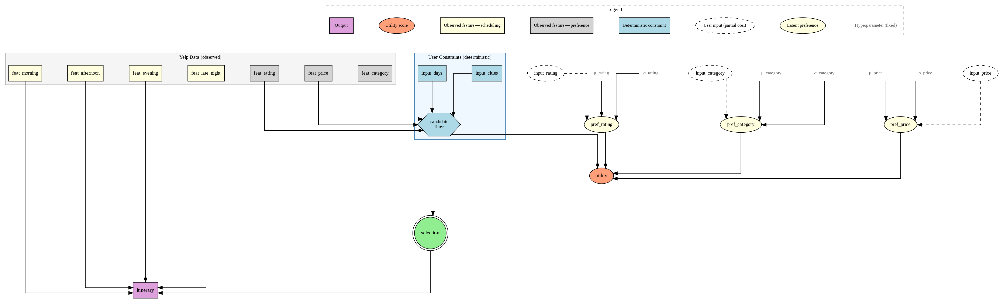
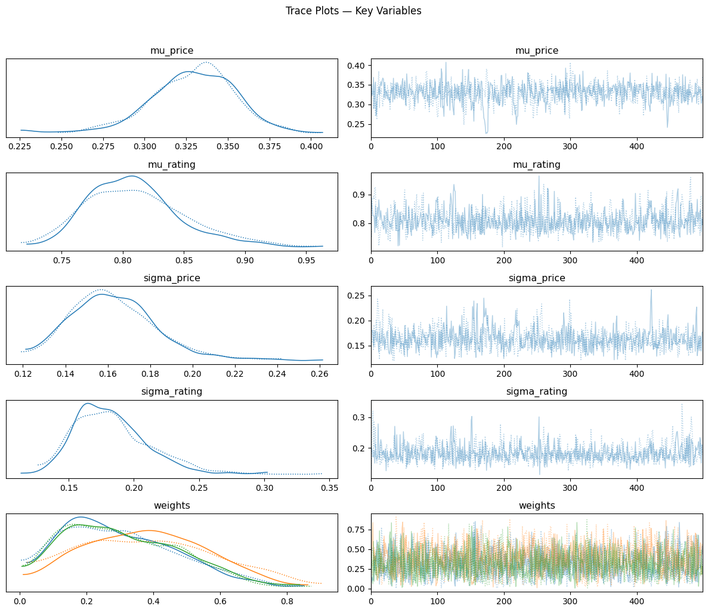
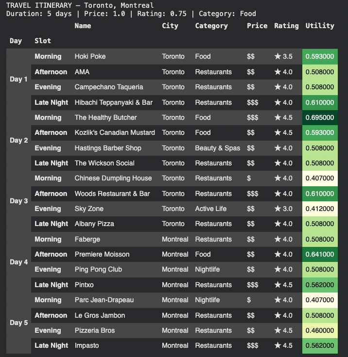

[README.md](https://github.com/user-attachments/files/25925600/README.md)
# Bayesian Travel Itinerary Generation Under Preference Uncertainty
### Bayes Ex Machina 🗺️

> *What if your next trip was planned not by an algorithm that thinks it knows you — but by one that honestly admits what it doesn't know, and reasons from there?*

**Emily Zhang · Mohammad Khan · Shawn Trewartha** | ADS MS / Bayesian Machine Learning · Final Project

---

## 01 — Why This Project?

Travel planning is an inference problem.

Every recommendation system faces the same dirty secret: it doesn't really know what you want. It guesses from proxies — past clicks, star ratings, vague budget signals. Most systems pretend that uncertainty doesn't exist.

We didn't. Instead of a single "best" answer, we built a system that **models preference uncertainty explicitly** using Bayesian inference — so the itineraries it produces are calibrated, diverse, and honest about what they don't know.

> **The core question:** Can a probabilistic model generate travel itineraries that respect user preferences — even when those preferences are uncertain, sparse, or contradictory?

A model trained to generate personalized itineraries must be driven by the same factors that guide a human when building an itinerary from scratch: where the user is traveling, how long they will be staying, and how much money they are willing to spend. This project looks to solve this problem using an MCMC + Bayesian probabilistic approach.

---

## 02 — Pipeline

Five stages, one trip.

| Stage | Name | What it does |
|-------|------|-------------|
| 01 | 🗄️ **Data Ingestion** | 150k+ Yelp businesses cleaned, accent-normalized & filtered to travel-relevant categories |
| 02 | 🔧 **Feature Engineering** | Price tiers, time-of-day slots, category encoding — derived from structured attributes & hours |
| 03 | 🕸️ **Dynamic Bayes Net** | pgmpy DBN captures how preferences evolve across days — morning coffee → evening nightlife |
| 04 | ⛓️ **MCMC Inference** | PyMC + NUTS samples posterior distributions over price, rating, and category utility weights |
| 05 | 🗺️ **Itinerary Generation** | Posterior predictive sampling + softmax selection → personalized multi-day, multi-city trips |

---

## 03 — Data

Powered by the [Yelp Open Dataset](https://business.yelp.com/data/resources/open-dataset/) (via [Kaggle](https://www.kaggle.com/datasets/darshank2019/business)), filtered to businesses relevant to travel: restaurants, museums, nightlife, parks, hotels, spas, and more.

This dataset only contained Yelp reviews from a handful of cities across the US and Canada — meaning this project represents more of a **proof of concept** rather than a final workable model that operates for any city in the world.

| Metric | Value |
|--------|-------|
| Total businesses (starting corpus) | 150,000+ |
| Travel category keywords | 27 |
| Time slots per day | 4 (Morning · Afternoon · Evening · Late Night) |
| Broad categories for modeling | 8 |

> **Engineering note:** The Yelp dataset is heavily skewed toward restaurants. We introduced a **40% per-category diversity cap** at inference time, ensuring itineraries don't collapse into an endless parade of dinner spots.

Additional data cleaning was required, including removing unnecessary characters across the dataset, filtering out businesses that wouldn't realistically be visited on a vacation, and manually assigning relative price scores and hours of operation to businesses where none were listed.

---

## 04 — DAGs

During training, simulated user preference profiles are provided as observed values for `input_price`, `input_rating`, `input_duration`, and `input_category`, allowing the model to learn population-level hyperparameters (the μ and σ nodes at the top).

At inference, a real user may supply some or all of these inputs. The population-level hyperparameters remain fixed, while the posterior over the latent preference nodes is updated based on available user inputs. The dashed user input nodes are fully observed during training but only partially observed during inference.



---

## 05 — The Model

A Bayesian generative model was constructed to approximate the likelihood that a user would patronize a selection of businesses. An MCMC approach was then taken to sample the calculated posteriors and generate itineraries given user-set parameters: time, budget, and location. The result is a personalized trip itinerary with each day broken into 4 time windows, complete with relative cost and star rating for each recommended business.

### 1. Dynamic Bayesian Network (pgmpy)

A DBN models temporal dependencies between activity choices across a multi-day trip. It captures the intuition that what you do in the morning shapes what feels right in the evening — and that preferences shift day to day.

### 2. Hierarchical Utility Model (PyMC)

Each user's utility for a business is modeled as a weighted sum of three components:

```
utility = w_price · price_match + w_rating · rating_match + w_category · category_match
```

The weights `w_price`, `w_rating`, and `w_category` are **random variables** drawn from a Dirichlet prior and inferred via MCMC. The model is honest: it knows it doesn't know how much you care about price vs. quality.

Sampling used the **NUTS sampler** (No U-Turn Sampler) — 2 chains, 2,000 draws each. Convergence assessed via R-hat and effective sample size (ESS).

---

## 06 — Diagnostics

| Metric | Result | Target |
|--------|--------|--------|
| R-hat (all params) | ≤ 1.02 | ≤ 1.01 |
| ESS (minimum) | 700+ | > 400 |
| Trace plots | 🐛 Healthy fuzzy caterpillars | No drift / stuck regions |



> **Honest caveat:** Posterior weight distributions are wide (HDI spans nearly 0–1 for all three weights). This resulted from the model being appropriately uncertain given synthetic user data with no real behavioral signal. At inference time, user input overrides the prior.

---

## 07 — Sample Output

Given user inputs — cities, trip length, price ceiling, minimum rating, and category preference — the system samples from the posterior and builds a day-by-day, slot-by-slot travel plan. Cities are distributed evenly across days. Three alternative itineraries are generated per run using different random seeds, all drawn from the same posterior.



---

## 08 — Tech Stack

| Library | Role |
|---------|------|
| `pymc` | MCMC sampling (NUTS) |
| `pgmpy` | Dynamic Bayesian Network |
| `arviz` | Posterior diagnostics & trace plots |
| `pandas` | Data wrangling & cleaning |
| `scipy` | Statistical utilities |
| `matplotlib` | Visualization |
| `networkx` | Graph structure |
| `ipywidgets` | Interactive itinerary UI |
| Google Colab | Runtime environment |

---

## 09 — Key Takeaways

**Bayesian models compose naturally.** Pairing a DBN for temporal structure with a hierarchical utility model for preference gave us both interpretability and flexibility.

**Applying Bayesian + MCMC modeling to real world data can be tricky.** For one, Yelp has 10× more restaurants than museums. Without the diversity quota, every itinerary would've been dinner, dinner, dinner. Similarly, we had to ensure that multi-city itineraries pulled activities from the same city per day, and did not bounce back and forth between cities over multiple days. Structural constraints matter as much as probabilistic ones.

**Uncertainty can be a feature.** The wide posterior distributions on utility weights reflect that user preferences are hard to distinguish from sparse data.

---

## 10 — Notes & Future Work

This dataset is limited to only a handful of cities, and thus is not operational for a full user experience. Below are limitations of and opportunities for expanding this proof of concept:

1. The itinerary generation does not take into account the exact longitude and latitude of recommended businesses, only the city in which each business is located. This means that if a generated morning activity and afternoon activity were two hours apart, the model would not account for that when constructing the itinerary.

2. The dataset was heavily skewed towards restaurants, even after the activity diversity quota was implemented. A more robust training dataset with broader business data beyond restaurants would improve the true usability of this generator.

3. Output quality can be further improved by sourcing additional business data, such as peak hours/seasons, virality, and other variables that vacationers value in itinerary building.

> Overall, this project provides a strong proof of concept that Bayesian models using posterior sampling can construct logical, generative text-based models.

---

*Bayes Ex Machina · Emily Zhang · Mohammad Khan · Shawn Trewartha*
